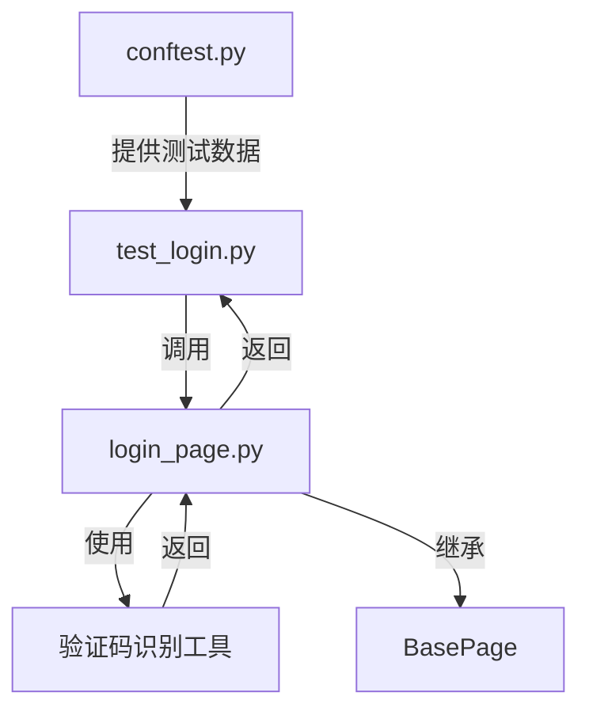

# Web登录测试用例开发指南

## 目录
- [1. 概述](#1-概述)
- [2. 技术架构（七层分层）](#2-技术架构七层分层)
- [3. 数据流向说明](#3-数据流向说明)
- [4. 编写思路与分层实现流程（主线流程）](#4-编写思路与分层实现流程主线流程)
  - [4.1 配置环境变量和测试账号](#41-配置环境变量和测试账号)
  - [4.2 实现/完善通用登录页面对象](#42-实现完善通用登录页面对象)
  - [4.3 准备测试数据和fixture](#43-准备测试数据和fixture)
  - [4.4 编写通用登录测试用例](#44-编写通用登录测试用例)
  - [4.5 运行与调试（本地验证）](#45-运行与调试本地验证)
- [5. CI集成与报告归档](#5-ci集成与报告归档)
- [6. 邮件通知与报告发送](#6-邮件通知与报告发送)
- [7. 常见问题FAQ](#7-常见问题faq)
- [8. 术语解释](#8-术语解释)
- [9. 易错点提醒](#9-易错点提醒)
- [10. 常见难点与解决方案](#10-常见难点与解决方案)

---

## 1. 概述

本指南适用于基于本自动化测试框架的所有Web项目，帮助你快速理解和开发通用的Web登录自动化测试用例。
- 适用场景：企业Web系统、SaaS平台、B端管理后台等。
- 覆盖场景：正常登录流程、验证码识别与处理、异常场景处理。

注意：本项目使用 Playwright 的异步 API 实现Web测试，所有页面交互都是异步操作。

---

## 2. 技术架构（七层分层）

遵循项目七层架构设计：

```
【第1层】测试用例层：tests/web/login/test_login.py
【第2层】固件层：tests/web/conftest.py
【第3层】业务对象层：src/web/pages/login_page.py
【第4层】平台实现层：src/web/
【第5层】核心抽象层：src/core/base/
【第6层】工具层：src/utils/
【第7层】外部集成层：pyproject.toml、config/、.env等
```

---

## 3. 数据流向说明



**说明：**
- 测试用例（A）通过fixture（E）获取测试数据和页面对象，调用页面对象（B）的方法。
- 页面对象（B）内部调用验证码识别工具（C）、继承基础页面（D）。
- 所有数据和依赖通过fixture和配置文件注入，保证解耦和通用性。

---

## 4. 编写思路与分层实现流程（主线流程）

### 4.1 配置环境变量和测试账号
- 说明：如何配置.env和config/settings.yaml
- 示例：.env片段
- 新手提示

**常见配置项（.env或config/settings.yaml）：**
```ini
EMAIL_ENABLED=true
EMAIL_SMTP_SERVER=smtp.example.com
EMAIL_SMTP_PORT=465
EMAIL_USE_SSL=true
EMAIL_SENDER=test@example.com
EMAIL_PASSWORD=your_mail_password
EMAIL_RECIPIENTS=qa-team@example.com,dev-team@example.com
EMAIL_SUBJECT=自动化测试报告
EMAIL_BODY=详见附件Allure测试报告
```

### 4.2 实现/完善通用登录页面对象
- 本层只负责页面元素的封装与页面操作，其他如数据准备、断言等职责交由对应层实现。
- 说明：页面对象职责
- 示例：LoginPage代码片段

```python
# src/web/pages/login_page.py
from src.core.base.page import BasePage
from src.utils.ocr import OCRHelper

class LoginPage(BasePage):
    USERNAME_INPUT = "input[name='username']"
    PASSWORD_INPUT = "input[name='password']"
    CAPTCHA_INPUT = "input[name='captcha']"
    CAPTCHA_IMG = "#captcha-img"
    LOGIN_BUTTON = "button[type='submit']"
    WELCOME_MESSAGE = ".welcome-message"

    async def login(self, username: str, password: str) -> bool:
        await self.type_text(self.USERNAME_INPUT, username)
        await self.type_text(self.PASSWORD_INPUT, password)
        # 验证码处理
        captcha_img = await self.get_element(self.CAPTCHA_IMG).screenshot()
        captcha_text = await OCRHelper().recognize(captcha_img)
        await self.type_text(self.CAPTCHA_INPUT, captcha_text)
        await self.get_element(self.LOGIN_BUTTON).click()
        return await self.is_element_visible(self.WELCOME_MESSAGE)
```

### 4.3 准备测试数据和fixture
- 本层只负责提供driver、页面对象和测试数据，其他如页面操作、断言等职责交由对应层实现。
- 说明：如何用fixture提供driver、页面对象、测试数据
- 示例：conftest.py片段

```python
# tests/web/conftest.py
import pytest
from src.web.pages.login_page import LoginPage

@pytest.fixture(scope="function")
async def login_page(page):
    page_obj = LoginPage(page)
    await page.goto("https://test.example.com/login")
    return page_obj

@pytest.fixture(scope="session")
def test_users():
    return {
        "valid_user": {"username": "test", "password": "pass"},
        "invalid_user": {"username": "bad", "password": "bad"}
    }
```

### 4.4 编写通用登录测试用例
- 本层只负责用例流程和断言，页面操作、数据准备等职责交由对应层实现。
- 说明：如何编写pytest用例
- 示例：test_login.py片段

```python
# tests/web/login/test_login.py
import pytest

@pytest.mark.asyncio
async def test_login_success(login_page, test_users):
    user = test_users["valid_user"]
    result = await login_page.login(user["username"], user["password"])
    assert result is True

@pytest.mark.asyncio
async def test_login_fail(login_page, test_users):
    user = test_users["invalid_user"]
    result = await login_page.login(user["username"], user["password"])
    assert result is False
```

### 4.5 运行与调试（本地验证）
- 说明：如何本地运行、调试、查看报告
- 示例：命令行

- 安装依赖：`poetry install`
- 配置环境变量：`cp .env.example .env` 并填写实际值
- 运行用例：`pytest tests/web/login/test_login.py -v`
- 查看报告：`allure serve ./reports/allure`
- 常见调试：
  - `--headed`参数可显示浏览器界面
  - `-k test_login_success`只运行指定用例
  - 检查日志和截图定位问题

---

## 5. CI集成与报告归档

本节介绍如何在GitHub Actions自动化测试中集成Allure报告归档，并与Jenkins联动，实现企业级CI/CD最佳实践。

### 9.1 GitHub Actions自动化测试与Allure报告归档

**标准CI脚本示例（.github/workflows/test.yml）：**

```yaml
ame: CI

on:
  push:
    branches: [ main, develop ]
  pull_request:
    branches: [ main, develop ]

jobs:
  test:
    runs-on: ubuntu-latest
    steps:
      - uses: actions/checkout@v2
      - name: Set up Python
        uses: actions/setup-python@v2
        with:
          python-version: '3.11'
      - name: Install dependencies
        run: |
          poetry install
          pip install allure-pytest
      - name: Install Allure CLI
        run: |
          sudo apt-get update
          sudo apt-get install -y default-jre
          wget https://github.com/allure-framework/allure2/releases/download/2.27.0/allure-2.27.0.tgz
          tar -zxvf allure-2.27.0.tgz
          sudo mv allure-2.27.0 /opt/allure
          sudo ln -s /opt/allure/bin/allure /usr/bin/allure
          allure --version
      - name: Run tests
        run: |
          pytest --alluredir=allure-results
      - name: Generate Allure Report
        run: |
          allure generate allure-results -o allure-report --clean
      - name: Upload Allure Report
        uses: actions/upload-artifact@v2
        with:
          name: allure-report
          path: allure-report
      # 可选：触发Jenkins Job
      - name: Trigger Jenkins Job
        if: github.ref == 'refs/heads/main'
        env:
          JENKINS_USER: ${{ secrets.JENKINS_USER }}
          JENKINS_TOKEN: ${{ secrets.JENKINS_TOKEN }}
        run: |
          curl -X POST "http://jenkins.example.com/job/your-job/buildWithParameters?token=YOUR_TOKEN&branch=${GITHUB_REF_NAME}" \
            --user "$JENKINS_USER:$JENKINS_TOKEN"
```

**说明：**
- 自动安装Allure CLI，保证报告生成环境一致。
- 测试完成后自动生成HTML报告并上传为artifact，便于团队成员下载和归档。
- 可选步骤：在主分支合并后自动触发Jenkins Job，实现多平台/多阶段流水线联动。

### 9.2 GitHub Actions触发Jenkins Job（联动方式）

- 通过`curl`命令调用Jenkins的`buildWithParameters`接口，可传递分支、环境等参数。
- Jenkins需提前配置好API Token和Job参数。
- 推荐将Jenkins用户名和Token存储在GitHub Secrets中，保证安全。

**示例命令：**
```bash
curl -X POST "http://jenkins.example.com/job/your-job/buildWithParameters?token=YOUR_TOKEN&branch=main" \
  --user "your-jenkins-user:your-jenkins-api-token"
```

### 9.3 Jenkins侧配置说明

- Jenkins Job建议配置为参数化构建，支持接收分支、环境等参数。
- Job脚本中拉取GitHub代码（可用Git插件），并执行自动化测试命令：

```groovy
pipeline {
  agent any
  parameters {
    string(name: 'branch', defaultValue: 'main', description: 'Git分支')
  }
  stages {
    stage('Checkout') {
      steps {
        git branch: "${params.branch}", url: 'https://github.com/your-org/your-repo.git'
      }
    }
    stage('Install & Test') {
      steps {
        sh 'poetry install'
        sh 'pytest --alluredir=allure-results'
        sh 'allure generate allure-results -o allure-report --clean'
      }
    }
    stage('Archive Allure Report') {
      steps {
        archiveArtifacts artifacts: 'allure-report/**', fingerprint: true
      }
    }
  }
}
```

### 9.4 联动场景与优势

- **主力CI用GitHub Actions**，保证开发、测试、报告归档一体化，适合敏捷开发和团队协作。
- **Jenkins补充复杂部署、跨项目集成**，如自动化部署、集成测试、生产环境发布等。
- **两者联动**，可实现"开发-测试-部署"全流程自动化，兼顾现代云原生和企业级定制需求。
- **报告归档**：无论在哪个平台生成，Allure报告都可作为artifact归档，便于团队随时下载和历史追溯。

### 9.5 新手注意事项

- Jenkins Job需提前配置好API Token和参数化构建。
- GitHub Actions与Jenkins联动时，敏感信息（如Token）务必用Secrets管理，**绝不硬编码在代码或配置文件中**。
- Allure CLI必须在CI环境自动安装，不能只依赖本地。
- 推荐所有报告、日志都通过artifact归档，避免直接提交到代码仓库。

> 如需定制企业内部CI/CD流程，请参考`ci/scripts/`目录和团队CI规范。

### 9.6 GitLab CI与Jenkins联动示例

#### 9.6.1 GitLab CI自动化测试与Allure报告归档

**标准.gitlab-ci.yml示例：**

```yaml
stages:
  - test
  - report

variables:
  ALLURE_VERSION: "2.27.0"

before_script:
  - apt-get update && apt-get install -y default-jre wget
  - wget https://github.com/allure-framework/allure2/releases/download/${ALLURE_VERSION}/allure-${ALLURE_VERSION}.tgz
  - tar -zxvf allure-${ALLURE_VERSION}.tgz
  - mv allure-${ALLURE_VERSION} /opt/allure
  - ln -s /opt/allure/bin/allure /usr/bin/allure
  - allure --version

pytest:
  stage: test
  script:
    - poetry install
    - pytest --alluredir=allure-results
  artifacts:
    paths:
      - allure-results/
    expire_in: 1 week

allure_report:
  stage: report
  script:
    - allure generate allure-results -o allure-report --clean
  dependencies:
    - pytest
  artifacts:
    paths:
      - allure-report/
    expire_in: 1 week
```

**说明：**
- 自动安装Allure CLI，保证报告生成环境一致。
- 测试完成后自动生成HTML报告并上传为artifact，便于团队成员下载和归档。

#### 9.6.2 GitLab CI触发Jenkins Job（联动方式）

- 通过`curl`命令调用Jenkins的`buildWithParameters`接口，可传递分支、环境等参数。
- Jenkins需提前配置好API Token和Job参数。
- 推荐将Jenkins用户名和Token存储在GitLab CI/CD变量中，保证安全。

**示例命令：**
```bash
curl -X POST "http://jenkins.example.com/job/your-job/buildWithParameters?token=YOUR_TOKEN&branch=$CI_COMMIT_REF_NAME" \
  --user "$JENKINS_USER:$JENKINS_TOKEN"
```

**在.gitlab-ci.yml中集成：**
```yaml
jenkins_trigger:
  stage: report
  script:
    - |
      if [ "$CI_COMMIT_REF_NAME" = "main" ]; then
        curl -X POST "http://jenkins.example.com/job/your-job/buildWithParameters?token=YOUR_TOKEN&branch=$CI_COMMIT_REF_NAME" \
          --user "$JENKINS_USER:$JENKINS_TOKEN"
      fi
  only:
    - main
```

#### 9.6.3 Jenkins侧配置说明

- Jenkins Job建议配置为参数化构建，支持接收分支、环境等参数。
- Job脚本与前述GitHub Actions联动groovy脚本一致。

#### 9.6.4 联动场景与优势

- **主力CI用GitLab CI**，保证开发、测试、报告归档一体化，适合企业私有化部署和团队协作。
- **Jenkins补充复杂部署、跨项目集成**，如自动化部署、集成测试、生产环境发布等。
- **两者联动**，可实现"开发-测试-部署"全流程自动化，兼顾现代云原生和企业级定制需求。
- **报告归档**：无论在哪个平台生成，Allure报告都可作为artifact归档，便于团队随时下载和历史追溯。

#### 9.6.5 新手注意事项

- Jenkins Job需提前配置好API Token和参数化构建。
- GitLab CI与Jenkins联动时，敏感信息（如Token）务必用CI/CD变量管理。
- Allure CLI必须在CI环境自动安装，不能只依赖本地。
- 推荐所有报告、日志都通过artifact归档，避免直接提交到代码仓库。

> 如需定制企业内部CI/CD流程，请参考`ci/scripts/`目录和团队CI规范。

---

## 6. 邮件通知与报告发送

本节介绍如何在用例执行后，自动将Allure测试报告发送到目标邮箱，实现测试结果的自动化通知。

### 6.1 框架内置邮件发送能力

- 框架已内置邮件发送工具（如`src/utils/email_notifier.py`），支持发送带附件的测试报告。
- 邮件参数（SMTP服务器、发件人、收件人、密码等）通过`.env`和`config/settings.yaml`配置，支持多环境切换。

**常见配置项（.env或config/settings.yaml）：**
```ini
EMAIL_ENABLED=true
EMAIL_SMTP_SERVER=smtp.example.com
EMAIL_SMTP_PORT=465
EMAIL_USE_SSL=true
EMAIL_SENDER=test@example.com
EMAIL_PASSWORD=your_mail_password
EMAIL_RECIPIENTS=qa-team@example.com,dev-team@example.com
EMAIL_SUBJECT=自动化测试报告
EMAIL_BODY=详见附件Allure测试报告
```

### 6.2 发送Allure报告的典型用法

- 测试执行完成后，生成Allure HTML报告（如`allure-report/`），可将其压缩为zip包作为邮件附件。
- 使用框架内置的邮件发送脚本（如`src/utils/email_notifier.py`），自动发送报告。

**本地命令行用法示例：**
```bash
python src/utils/email_notifier.py --subject "自动化测试报告" \
  --body "详见附件Allure测试报告" \
  --to qa-team@example.com,dev-team@example.com \
  --attach allure-report.zip
```

### 6.3 CI流水线集成邮件发送（以GitHub Actions为例）

**1. 在CI脚本中添加压缩和发送步骤：**
```yaml
- name: Zip Allure Report
  run: |
    zip -r allure-report.zip allure-report

- name: Send Allure Report Email
  env:
    EMAIL_ENABLED: true
    EMAIL_SMTP_SERVER: ${{ secrets.EMAIL_SMTP_SERVER }}
    EMAIL_SMTP_PORT: ${{ secrets.EMAIL_SMTP_PORT }}
    EMAIL_USE_SSL: ${{ secrets.EMAIL_USE_SSL }}
    EMAIL_SENDER: ${{ secrets.EMAIL_SENDER }}
    EMAIL_PASSWORD: ${{ secrets.EMAIL_PASSWORD }}
    EMAIL_RECIPIENTS: ${{ secrets.EMAIL_RECIPIENTS }}
  run: |
    python src/utils/email_notifier.py --subject "自动化测试报告" \
      --body "详见附件Allure测试报告" \
      --to "$EMAIL_RECIPIENTS" \
      --attach allure-report.zip
```

**2. 说明：**
- 邮件参数建议通过CI平台的Secrets/变量安全注入。
- 支持多收件人，支持自定义主题和正文。
- 可根据实际需要调整附件路径、邮件内容。

### 6.4 新手注意事项

- 邮件发送前请确保SMTP配置正确，发件人邮箱有权限发送。
- 邮件密码/授权码等敏感信息请勿写死在代码，务必用.env或CI Secrets管理，**绝不硬编码**。
- 邮件附件建议压缩后发送，避免大文件传输失败。
- 可在config/settings.yaml中配置邮件开关，支持按需启用/禁用。
- 邮件通知功能适合回归测试、定时任务、CI流水线等场景。

> 如需定制企业内部邮件通知流程，请参考`ci/scripts/`目录和团队CI规范。

---

## 7. 常见问题FAQ

- **Q: 运行时报web_base_url未设置？**
  - 检查.env和config文件，变量名区分大小写。
- **Q: 用例找不到页面元素？**
  - 检查选择器是否与实际页面一致。
- **Q: 验证码识别总是失败？**
  - 检查OCR工具是否安装、图片是否清晰。
- **Q: 如何切换测试环境？**
  - 修改.env中的APP_ENV或WEB_BASE_URL。
- **Q: 依赖安装失败？**
  - 检查poetry、Python版本，或清理虚拟环境重试。
- **Q: 如何自定义测试数据/环境切换？**
  - 可在`data/`目录下添加自定义YAML/JSON测试数据文件，通过fixture加载。
  - 环境切换可通过修改.env中的`APP_ENV`或`WEB_BASE_URL`，或在CI中注入环境变量实现。

---

## 8. 术语解释

- **fixture**：pytest的测试夹具，用于提供测试依赖（如driver、数据）。
- **Page Object**：页面对象模式，将页面操作封装为类和方法。
- **OCR**：光学字符识别，用于验证码自动识别。
- **CI/CD**：持续集成/持续部署，自动化测试和发布流程。
- **环境变量**：通过.env或CI平台注入的配置参数。
- **断言**：测试用例中判断预期结果的语句。

---

## 9. 易错点提醒

> - 不要在测试用例里直接操作driver或元素，统一通过页面对象。
> - 所有敏感信息和环境差异都用.env和config管理，严禁写死在代码里。
> - 新增变量时记得同步更新.env.example。
> - 只在对应层做对应的事，分层解耦，便于维护。 

---

## 10. 常见难点与解决方案

本节总结Web自动化测试中常见的几个棘手问题及其应对策略。

### 10.1 难点一：动态/复杂UI元素的稳定定位与交互

**问题总结：**
现代Web应用大量使用动态ID/类名、前端框架、异步加载、iframe、Shadow DOM等，导致元素定位困难且不稳定。

**解决方案：**
1.  **优先使用稳定定位器：** 强烈推荐使用固定的`data-testid`属性。备选方案包括`name`, `title`, `aria-label`或可见文本。避免使用易变的`class`，谨慎使用复杂的XPath。
2.  **利用Playwright高级定位：**
    *   **iframe:** 使用`page.frame_locator()`。
    *   **Shadow DOM:** Playwright原生支持，直接使用CSS选择器（如`comp >> internal-el`）。
    *   **组合定位:** 使用`:has()`, `:near()`等增强定位精度。
3.  **结合智能等待：** 必须使用显式等待，确保元素达到**可见(visible)**或**可交互(enabled/clickable)**状态后再操作，而不是仅**存在(attached/present)**。利用框架封装的`wait_for_element_visible`等方法。
4.  **封装复杂交互：** 将拖拽、日期选择等多步操作封装在Page Object或组件方法中。

### 10.2 难点二：CI/CD环境一致性与依赖管理

**问题总结：**
"本地能跑，CI失败"的常见原因是本地与CI环境（OS、浏览器、依赖版本等）不一致，以及CI工具链配置复杂、依赖安装失败和敏感信息管理不当。

**解决方案：**
1.  **容器化测试环境 (Docker)：** 提供`Dockerfile`定义标准测试镜像，本地和CI均使用该镜像，是保证环境一致性的最佳实践。
2.  **严格依赖版本控制 (Poetry)：** 必须使用`poetry`并提交`poetry.lock`，CI流程使用`poetry install`确保版本一致。
3.  **优化CI依赖安装：** 配置CI平台的缓存机制（如`actions/cache`）加速依赖安装。
4.  **标准化与简化CI脚本：** 遵循项目CI模板，将复杂步骤封装到`ci/scripts/`目录。
5.  **安全管理敏感信息：** 严禁硬编码！使用CI平台的Secrets/Variables注入环境变量，非敏感配置通过`config/`和`.env`管理。

### 10.3 难点三：智能等待策略的设计与应用

**问题总结：**
不恰当的等待（如硬编码`time.sleep`、误用隐式等待）导致测试不稳定、效率低下。对异步加载处理不当，或混淆元素状态（存在、可见、可交互）是常见错误。

**解决方案：**
1.  **以显式等待为主，精准控制：** 针对交互点和状态变化，使用显式等待，明确等待**元素**、**条件**和**超时时间**。优先使用框架封装的等待方法。
2.  **理解Playwright自动等待：** Playwright核心API（如`click`, `fill`, `expect().to_be_visible()`）内置自动等待，避免冗余代码。
3.  **选择合适的等待策略：**
    *   **网络请求：** 使用`page.wait_for_response()`。
    *   **复杂JS逻辑：** 使用`page.wait_for_function()`。
    *   **页面导航：** `page.goto()`等方法通常会自动处理，特殊情况可用`page.wait_for_load_state()`。
4.  **合理配置超时时间：** 设置全局默认超时，对特定慢操作局部覆盖超时设置。
5.  **谨慎使用重试：** 可用`pytest-rerunfailures`或针对性封装处理偶发性失败，但不应滥用。 