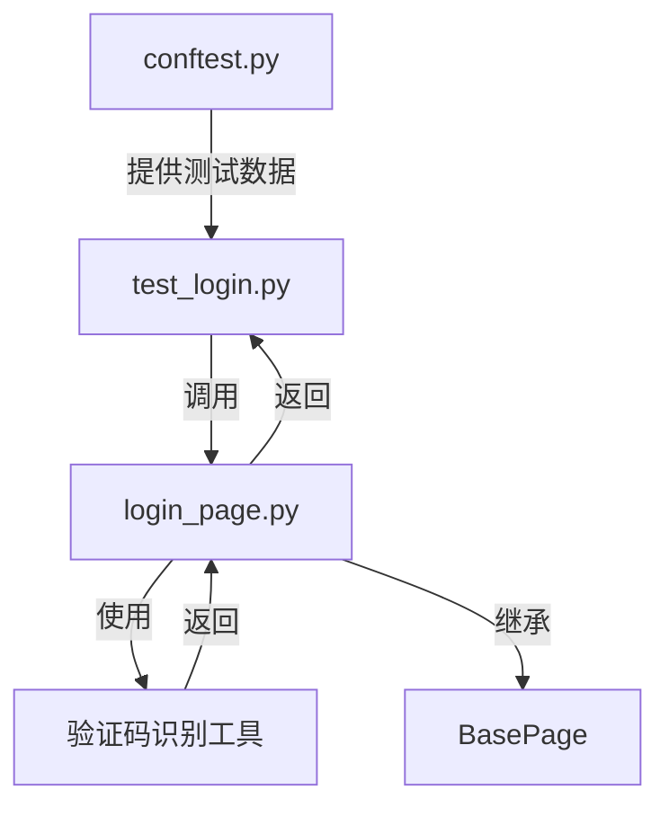

# Web登录测试用例开发指南

## 1. 概述

本指南将帮助你理解和开发OMP系统的Web登录自动化测试。测试将覆盖以下场景：
- 正常登录流程
- 验证码识别与处理
- 异常场景处理

注意：本项目使用 Playwright 的异步 API 实现Web测试，所有页面交互都是异步操作。

## 2. 技术架构

遵循项目七层架构设计：

```
【第1层】测试用例层：tests/web/test_login.py
【第2层】固件层：tests/web/conftest.py
【第3层】业务对象层：src/web/pages/login_page.py
【第4层】平台实现层：src/web/
【第5层】核心抽象层：src/core/base/
【第6层】工具层：src/utils/
【第7层】外部集成层：pyproject.toml(管理依赖)
```

## 3. 数据流向



## 4. 实现步骤

### 4.1 环境准备

1. 安装依赖
```bash
poetry install  # 安装所有依赖
```

2. 环境变量配置
创建`.env.example`文件：
```ini
# Web配置
WEB_BASE_URL=https://test.cmpo1914.com:3006/omp/
WEB_TIMEOUT=30
WEB_RETRY_TIMES=3

# 测试账号
TEST_VALID_USERNAME=your_test_user
TEST_VALID_PASSWORD=your_test_pass

# 邮件配置
MAIL_SENDER=test@example.com
MAIL_PASSWORD=your_mail_password
MAIL_SMTP_HOST=smtp.example.com
```

复制`.env.example`为`.env`并填入实际值。

### 4.2 代码实现

#### 4.2.1 页面对象实现
文件：`src/web/pages/login_page.py`

```python
from typing import Optional
from playwright.async_api import Page, ElementHandle
from src.core.base.page import BasePage
from src.utils.ocr import OCRHelper
from src.utils.waits import wait_for_condition
from src.core.base.errors import (
    ElementNotFoundError,
    ElementNotVisibleError,
    ElementNotInteractableError,
    TimeoutError,
    NavigationError,
    CaptchaError
)

class LoginPage(BasePage):
    """登录页面对象，处理登录相关的所有操作
    
    属性:
        driver: Page对象
        ocr: 验证码识别工具
    """
    
    def __init__(self, driver: Page) -> None:
        """初始化登录页面对象
        
        Args:
            driver: Playwright的Page对象
        """
        super().__init__(driver)
        self._setup_locators()
        self._setup_logger()
        self._setup_ocr()
        
    def _setup_locators(self) -> None:
        """初始化元素定位器"""
        self._locators = {
            "username": "input[name='username']",
            "password": "input[name='password']",
            "captcha_input": "input[name='captcha']",
            "captcha_img": "#captcha-img",
            "login_button": "button[type='submit']",
            "welcome_message": ".welcome-message"
        }
        
    async def login(self, username: str, password: str) -> bool:
        """执行登录操作
        
        Args:
            username: 用户名
            password: 密码
            
        Returns:
            bool: 登录是否成功
            
        Raises:
            ElementNotFoundError: 元素未找到
            ElementNotVisibleError: 元素不可见
            ElementNotInteractableError: 元素不可交互
            CaptchaError: 验证码处理失败
            TimeoutError: 操作超时
            NavigationError: 页面导航失败
        """
        try:
            await self._fill_login_form(username, password)
            await self._handle_captcha()
            await self._submit_login()
            return await self._verify_login_result()
        except Exception as e:
            await self._handle_login_error(e)
            return False
            
    async def _fill_login_form(self, username: str, password: str) -> None:
        """填写登录表单
        
        Args:
            username: 用户名
            password: 密码
            
        Raises:
            ElementNotFoundError: 表单元素未找到
            ElementNotInteractableError: 元素不可交互
        """
        await self.type_text(self._locators["username"], username)
        await self.type_text(self._locators["password"], password)
        
    async def _handle_captcha(self) -> None:
        """处理验证码识别和输入
        
        Raises:
            CaptchaError: 验证码处理失败
            ElementNotFoundError: 验证码元素未找到
        """
        try:
            captcha_element = await self.get_element(self._locators["captcha_img"])
            captcha_img = await captcha_element.screenshot()
            captcha_text = await self.ocr.recognize(captcha_img)
            self.logger.info(f"验证码识别结果: {captcha_text}")
            await self.type_text(self._locators["captcha_input"], captcha_text)
        except Exception as e:
            raise CaptchaError(f"验证码处理失败: {str(e)}")
            
    async def _verify_login_result(self) -> bool:
        """验证登录结果
        
        Returns:
            bool: 登录是否成功
        """
        try:
            await wait_for_condition(
                lambda: self.is_element_visible(self._locators["welcome_message"]),
                message="登录验证超时"
            )
            return True
        except TimeoutError:
            self.logger.warning("登录可能失败 - 未找到欢迎信息")
            return False
```

#### 4.2.2 OCR工具实现
文件：`src/utils/ocr.py`

```python
from typing import Optional
import ddddocr
from contextlib import asynccontextmanager
from src.core.base.errors import OCRError

class OCRHelper:
    """验证码识别工具类
    
    使用ddddocr进行验证码识别，支持异步操作和资源管理
    """
    
    def __init__(self):
        self._ocr = None
        
    @asynccontextmanager
    async def _get_ocr(self):
        """获取OCR实例的异步上下文管理器"""
        if not self._ocr:
            self._ocr = ddddocr.DdddOcr()
        try:
            yield self._ocr
        except Exception as e:
            raise OCRError(f"OCR操作失败: {str(e)}")
            
    async def recognize(self, image_bytes: bytes) -> str:
        """识别验证码
        
        Args:
            image_bytes: 图片二进制数据
            
        Returns:
            str: 识别出的文本
            
        Raises:
            OCRError: OCR识别失败
        """
        async with self._get_ocr() as ocr:
            try:
                return ocr.classification(image_bytes)
            except Exception as e:
                raise OCRError(f"验证码识别失败: {str(e)}")
```

#### 4.2.3 测试数据管理
文件：`data/test_users.yaml`

```yaml
valid_user:
  username: ${TEST_VALID_USERNAME}
  password: ${TEST_VALID_PASSWORD}
  expected: success
  
invalid_user:
  username: invalid_user
  password: invalid_pass
  expected: failure
```

#### 4.2.4 测试用例实现
文件：`tests/web/test_login.py`

```python
import pytest
from typing import Dict, Any
from playwright.async_api import Page
from src.web.pages.login_page import LoginPage
from src.utils.config import load_test_data

@pytest.mark.asyncio
class TestLogin:
    """登录功能测试类"""
    
    @pytest.mark.smoke
    async def test_login_success(
        self,
        page: Page,
        login_page: LoginPage,
        test_users: Dict[str, Any]
    ) -> None:
        """测试正常登录流程"""
        user = test_users["valid_user"]
        result = await login_page.login(
            username=user["username"],
            password=user["password"]
        )
        assert result is True, "登录应该成功"
        
    @pytest.mark.smoke
    async def test_login_invalid_credentials(
        self,
        page: Page,
        login_page: LoginPage,
        test_users: Dict[str, Any]
    ) -> None:
        """测试无效凭据登录"""
        user = test_users["invalid_user"]
        result = await login_page.login(
            username=user["username"],
            password=user["password"]
        )
        assert result is False, "使用无效凭据登录应该失败"
```

#### 4.2.5 测试固件实现
文件：`tests/web/conftest.py`

```python
import os
import pytest
from typing import Dict, Any, AsyncGenerator
from playwright.async_api import async_playwright, Page, Browser, BrowserContext
from src.web.pages.login_page import LoginPage
from src.utils.config import load_test_data

@pytest.fixture(scope="session")
def test_users() -> Dict[str, Any]:
    """提供测试用户数据"""
    return load_test_data("data/test_users.yaml")

@pytest.fixture(scope="session")
async def browser() -> AsyncGenerator[Browser, None]:
    """提供浏览器实例"""
    async with async_playwright() as p:
        browser = await p.chromium.launch()
        yield browser
        await browser.close()

@pytest.fixture(scope="function")
async def context(browser: Browser) -> AsyncGenerator[BrowserContext, None]:
    """提供浏览器上下文"""
    context = await browser.new_context()
    yield context
    await context.close()

@pytest.fixture(scope="function")
async def page(context: BrowserContext) -> AsyncGenerator[Page, None]:
    """提供页面实例"""
    page = await context.new_page()
    yield page
    await page.close()

@pytest.fixture(scope="function")
async def login_page(page: Page) -> LoginPage:
    """提供登录页面对象"""
    page_obj = LoginPage(page)
    await page.goto(os.getenv("WEB_BASE_URL"))
    return page_obj
```

### 4.3 智能等待策略

文件：`src/utils/waits.py`

```python
from typing import Any, Callable, Optional
from src.core.base.errors import TimeoutError

async def wait_for_condition(
    condition: Callable[[], Any],
    timeout: Optional[float] = None,
    interval: float = 0.5,
    message: str = ""
) -> Any:
    """智能等待直到条件满足
    
    Args:
        condition: 等待条件
        timeout: 超时时间(秒)，None使用默认值
        interval: 检查间隔(秒)
        message: 超时错误消息
    
    Returns:
        Any: 条件函数的返回值
        
    Raises:
        TimeoutError: 等待超时
    """
    import asyncio
    from src.utils.config import get_config
    
    timeout = timeout or get_config().get("web.timeout", 30)
    start_time = asyncio.get_event_loop().time()
    
    while True:
        try:
            result = await condition()
            if result:
                return result
        except Exception:
            pass
            
        if asyncio.get_event_loop().time() - start_time > timeout:
            raise TimeoutError(
                message or f"等待条件满足超时(超过{timeout}秒)"
            )
            
        await asyncio.sleep(interval)
```

## 5. 运行测试

1. 确保环境准备完成
```bash
poetry install  # 安装所有依赖
```

2. 设置环境变量
```bash
cp .env.example .env  # 复制环境变量模板
# 编辑.env文件填入实际值
```

3. 运行测试并生成Allure报告
```bash
poetry run pytest tests/web/test_login.py -v --alluredir=./reports/allure
poetry run allure serve ./reports/allure  # 本地查看报告
```

## 6. 注意事项

1. 验证码处理
- 使用OCR工具进行验证码识别
- 实现了重试机制处理识别失败情况
- 验证码处理封装在专门的方法中
- 详细的错误处理和日志记录

2. 异常处理
- 使用专门的异常类型(ElementNotFoundError等)
- 实现了智能等待机制避免固定等待
- 详细的错误日志记录
- 合理的超时设置(通过环境变量配置)

3. 测试数据管理
- 测试数据存储在YAML文件中
- 敏感信息通过环境变量注入
- 使用fixture提供测试数据
- 支持多环境配置

4. 资源管理
- 使用上下文管理器管理资源
- 自动清理浏览器实例
- OCR工具的异步资源管理
- 合理的作用域设置

## 7. 调试建议

1. 本地开发调试
```bash
# 启用浏览器界面
poetry run pytest tests/web/test_login.py --headed

# 开启详细日志
poetry run pytest tests/web/test_login.py -v --log-cli-level=DEBUG

# 只运行特定测试
poetry run pytest tests/web/test_login.py -k test_login_success
```

2. 问题排查
- 检查环境变量是否正确设置
- 查看详细的测试日志
- 使用Playwright的Trace功能记录执行过程
- 确认网络连接和测试环境状态

3. 性能优化
- 合理使用fixture的作用域
- 优化元素定位策略
- 调整等待策略的超时和间隔
- 必要时使用并行测试

4. 持续集成
- 配置CI环境变量
- 设置测试报告归档
- 配置失败通知
- 定期清理测试报告 